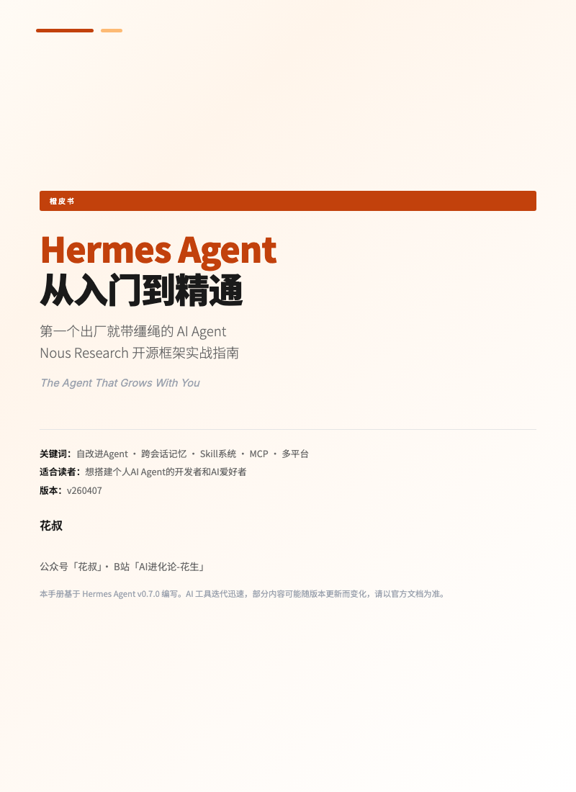
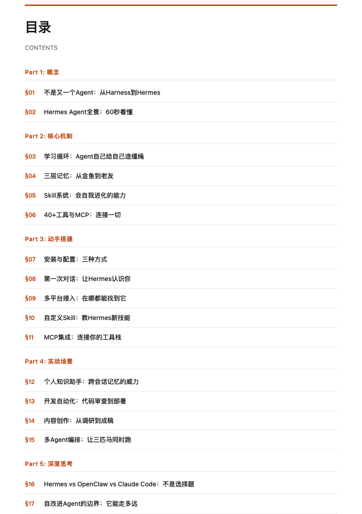
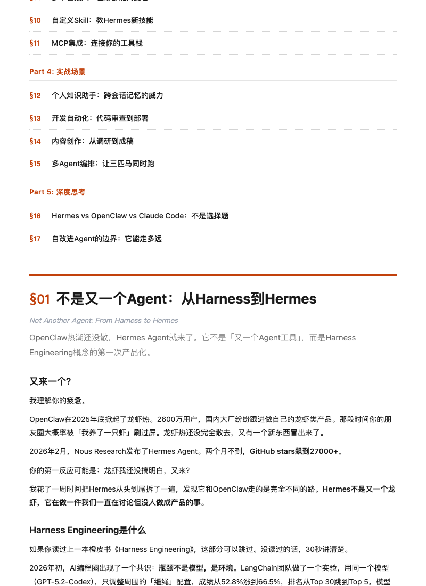
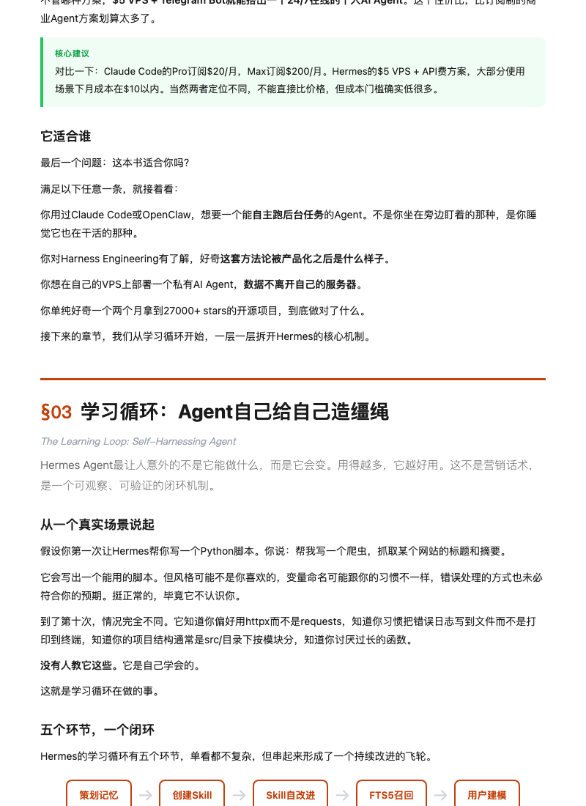

**English** | [中文](README_zh.md)

# Hermes Agent: The Complete Guide

> Orange Book Series · by HuaShu

A practical guide to [Hermes Agent](https://github.com/NousResearch/hermes-agent), the open-source AI Agent framework by [Nous Research](https://hermes-agent.nousresearch.com/). The first Agent that ships with reins built in — and the reins keep growing.

  
  

## Download

| Language | PDF |
|----------|-----|
| Chinese | **[PDF Download](https://pub-161ae4b5ed0644c4a43b5c6412287e03.r2.dev/latest/hermes-agent.pdf)** |
| English | **[PDF Download](https://pub-161ae4b5ed0644c4a43b5c6412287e03.r2.dev/latest/hermes-agent-en.pdf)** |

Also available on the [Releases](https://github.com/alchaincyf/hermes-agent-orange-book/releases) page.

## What This Book Covers

[Hermes Agent](https://github.com/NousResearch/hermes-agent) is an open-source AI Agent framework released by Nous Research in February 2026. Unlike OpenClaw and Claude Code, it takes a fundamentally different approach: a built-in self-improving learning loop, three-layer memory system, and automatic Skill creation and evolution.

If you've read the "Harness Engineering" Orange Book, Hermes is the first productization of those five components (instructions / constraints / feedback / memory / orchestration).

17 chapters across 5 parts:

| Part | Content | Chapters |
|------|---------|----------|
| Concepts | From Harness to Hermes | §01-02 |
| Core Mechanisms | Learning loop, memory, Skills, tool ecosystem | §03-06 |
| Hands-On Setup | Installation, first conversation, multi-platform, customization | §07-11 |
| Real-World Scenarios | Knowledge assistant, dev automation, content creation, multi-Agent | §12-15 |
| Deep Thinking | Three-way comparison, boundaries of self-improving Agents | §16-17 |

  
  

## Who Is This For

- Developers who've used Claude Code / OpenClaw / Cursor and want to understand Hermes
- AI enthusiasts who want to build a personal AI Agent
- Anyone interested in seeing Harness Engineering concepts turned into a real product

## Orange Book Series

This is part of the Orange Book series, which also includes: Claude Code: The Complete Guide, Harness Engineering, OpenClaw, and more.

All Orange Books free to download: **[huasheng.ai/orange-books](https://www.huasheng.ai/orange-books)**

## About the Author

**HuaShu** · AI Native Coder · Indie Developer

- WeChat: 花叔
- Bilibili: [AI进化论-花生](https://space.bilibili.com/14097567/)
- X/Twitter: [@AlchainHust](https://x.com/AlchainHust)
- YouTube: [@Alchain](https://www.youtube.com/@Alchain)
- Website: [huasheng.ai](https://www.huasheng.ai/)

## Version

- **v260408** — First edition, based on Hermes Agent v0.7.0
- AI tools evolve rapidly — some content may change with future versions. Refer to official docs for the latest.

## License

This work is licensed under [CC BY-NC-SA 4.0](https://creativecommons.org/licenses/by-nc-sa/4.0/).

You are free to share and adapt, with attribution, non-commercial use only, and same license for derivatives.
