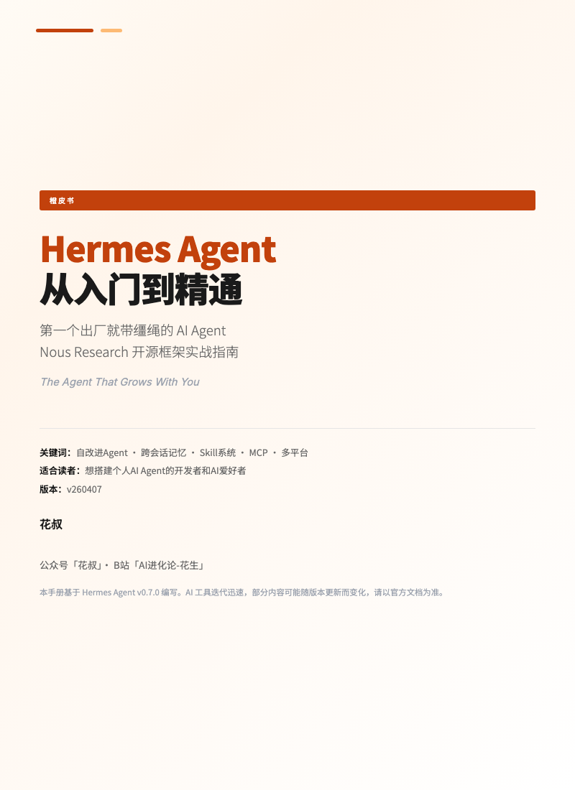
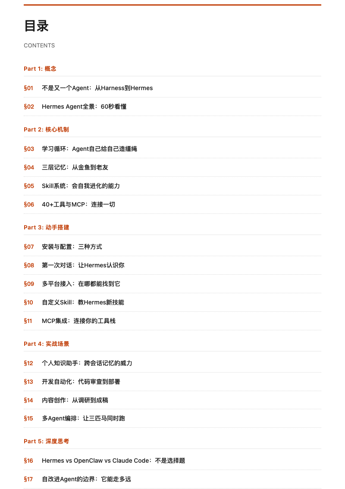
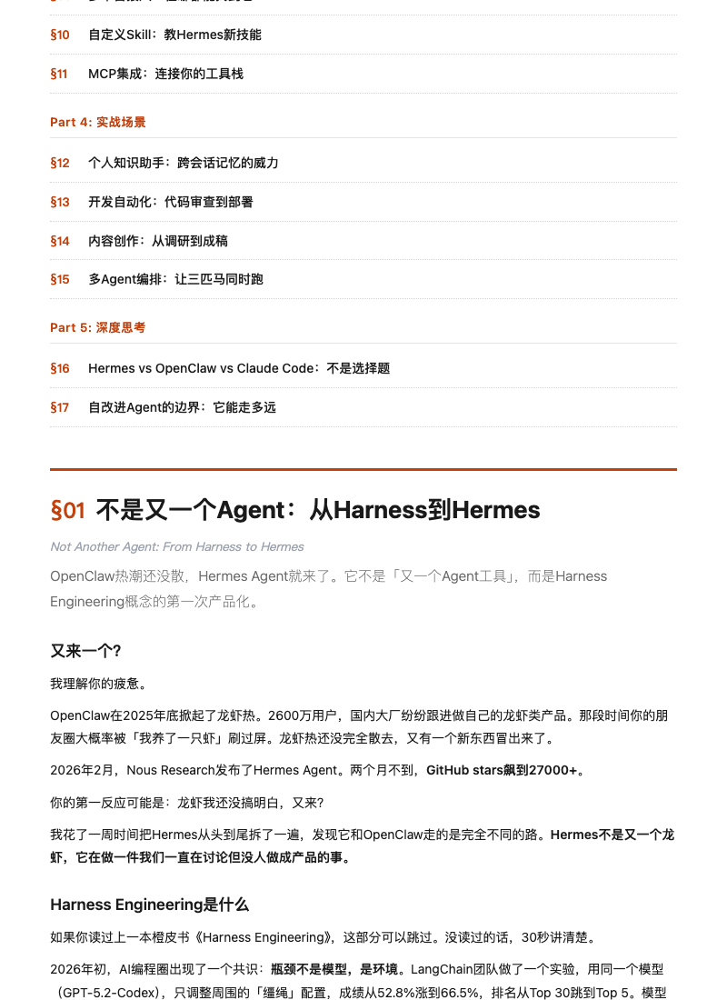
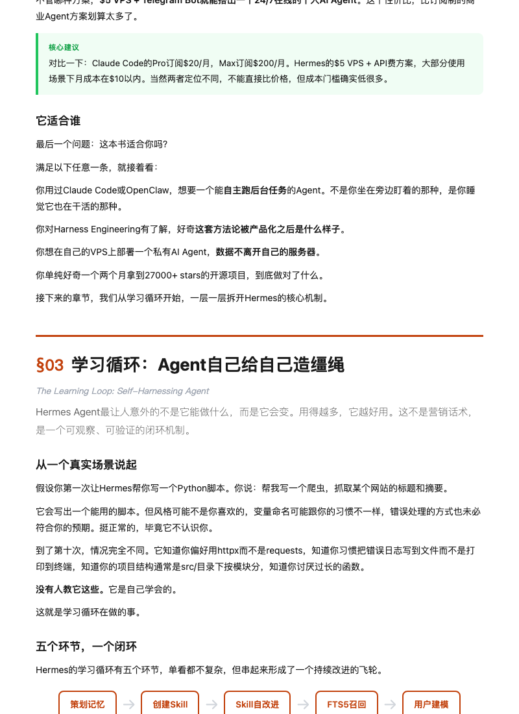

**English** | [中文版 README](README_zh.md)

<p align="center">
  
  <br/>
  <sub>Animated with <a href="https://github.com/alchaincyf/huashu-design">huashu-design</a> skill</sub>
</p>

# Hermes Agent 2.0: The Complete Guide

> 橙皮书 (Orange Book) Series · by HuaShu (花叔)

A hands-on guide to [Hermes Agent](https://github.com/NousResearch/hermes-agent), the open-source AI Agent framework by [Nous Research](https://hermes-agent.nousresearch.com/) — the first agent that ships with its "reins" built in, and the reins grow themselves.

**This is a from-scratch rewrite.** The first edition was based on Hermes v0.7.0. Two months and nine releases later, the product had grown a whole new face — a native desktop app, a full browser dashboard, 23 messaging platforms — so the book is rebuilt around v0.16.0 ("The Surface Release").

<p align="center">
  
  
</p>

## Download

| Version | PDF |
|---------|-----|
| 中文版 (Chinese) | **[PDF Download](https://github.com/alchaincyf/hermes-agent-orange-book/raw/main/Hermes-Agent橙皮书2.0-v260607.pdf)** |
| English | **[PDF Download](https://github.com/alchaincyf/hermes-agent-orange-book/raw/main/Hermes-Agent-The-Complete-Guide-v260607.pdf)** |

## Errata

**The data-collection inference in §03 ("Why Nous Built It") is wrong.** Thanks to [@lishaogang](https://github.com/lishaogang) for pointing this out in [issue #7](https://github.com/alchaincyf/hermes-agent-orange-book/issues/7).

Under "Motive one," the book claims that "Hermes Agent isn't just a product, it's also a massive-scale harvester that collects real-world data for Nous's own models," and draws a chain from "users' real usage → tool-call trajectories → compressed into training data → next-gen models." That chain breaks at its very first link:

- The official [FAQ](https://hermes-agent.nousresearch.com/docs/reference/faq) states plainly: API calls go only to the LLM provider you configure; Hermes Agent does not collect telemetry, usage data, or analytics; your conversations, memory, and skills are stored locally in `~/.hermes/`.
- The official [AGENTS.md](https://github.com/NousResearch/hermes-agent/blob/main/AGENTS.md) goes further, listing "outbound telemetry / usage attribution without opt-in gating" as a contribution that gets "rejected even when well-built" — code that would report data home is refused by the project itself.

In other words, your usage trajectories stay on your own machine; there is no channel feeding them back to Nous. The things the book cites — batch_runner.py, trajectory_compressor.py, the "Research-ready" section — are all real, but they are research infrastructure for Nous and researchers to batch-generate trajectories in their own environments, not a pipeline collecting data from users. I stretched "they have trajectory-generating infrastructure" into "they are harvesting your trajectories," and that step went too far. The original text did flag it as "my inference, not an official Nous statement" — but an inference directly contradicted by the official docs is still wrong, flag or no flag.

Accordingly, the "data flywheel" argument at the end of §03 doesn't hold either. Of the motives the book attributes to Nous, "monetizing through Portal" and "poaching OpenClaw's users" still stand; "users feeding it training data" should be struck.

The PDFs are build artifacts and have not been regenerated yet; this erratum stands here until the next revision corrects the body text. For product facts, trust the [official docs](https://hermes-agent.nousresearch.com/docs/).

## What This Book Covers

[Hermes Agent](https://github.com/NousResearch/hermes-agent) is an open-source AI Agent framework from Nous Research. Unlike OpenClaw and Claude Code, it takes a fundamentally different approach: a built-in self-improving learning loop, a three-layer memory system, automatic Skill creation and evolution, and — new this cycle — a persistent multi-agent Kanban platform and an honest, OS-level security model.

If you've read the "Harness Engineering" 橙皮书, Hermes is the productization of those five components (instructions / constraints / feedback / memory / orchestration).

**21 sections across 6 parts:**

| Part | Content | Sections |
|------|---------|----------|
| 1. What It Is | Meet Hermes, one brain many faces, why Nous built it | §01-03 |
| 2. The Reins Grow Themselves | Three engines of self-improvement, Curator, what not to learn | §04-06 |
| 3. How It Remembers You | Three-layer memory, session search, Skills, orchestrating agents | §07-10 |
| 4. Connecting Everything | 64 tools, MCP, 23 platforms, three surfaces | §11-14 |
| 5. Multi-Agent & Orchestration | From delegate_task to the Kanban platform, collaboration patterns | §15-17 |
| 6. Deployment, Security & Boundaries | Deploy, the OS boundary, Promptware defense, how far it can go | §18-21 |

## Optional X/Twitter Plugin

Part 4 readers can add X/Twitter search and monitoring with [Hermes Tweet](https://github.com/Xquik-dev/hermes-tweet). Install and enable the Hermes Agent plugin:

```bash
hermes plugins install Xquik-dev/hermes-tweet --enable
export XQUIK_API_KEY="xq_..."
```

Restart Hermes after setting the key. Use `tweet_explore` first, then call a listed route with `tweet_read`.

Private reads and X actions use `tweet_action`. It stays disabled unless you set `HERMES_TWEET_ENABLE_ACTIONS=true`. Review every action before enabling it.

Xquik is an independent third-party service. Not affiliated with X Corp. "Twitter" and "X" are trademarks of X Corp.

<p align="center">
  
  
</p>

## Who Is This For

- Developers who've used Claude Code / OpenClaw / Cursor and want to understand Hermes
- AI power users who don't live in the command line — Hermes now ships a desktop app, so this is for you too
- Anyone interested in seeing Harness Engineering concepts turned into a real, self-improving product

## 橙皮书 (Orange Book) Series

This is part of the 橙皮书 series — free, practical guides on AI tools. Other titles include Claude Code, Harness Engineering, OpenClaw, and more.

All books free to download: **[huasheng.ai/orange-books](https://www.huasheng.ai/orange-books)**

## About the Author

**HuaShu (花叔)** · AI Native Coder · Indie Developer

An AI content creator with 300K+ followers across platforms. Built all products (including an App Store #1 Paid iOS app) entirely with AI tools — never wrote a line of code manually. Open-sourced Nuwa.skill, huashu-design, and more.

- X/Twitter: [@AlchainHust](https://x.com/AlchainHust)
- YouTube: [@Alchain](https://www.youtube.com/@Alchain)
- Bilibili: [花叔](https://space.bilibili.com/14097567/)
- WeChat Official Account: 花叔
- Website: [huasheng.ai](https://www.huasheng.ai/)

## Version

- **v260607** — Second edition (2.0), a from-scratch rewrite based on Hermes Agent v0.16.0 ("The Surface Release")
- **v260408** — First edition, based on Hermes Agent v0.7.0
- AI tools evolve rapidly — refer to the [official docs](https://hermes-agent.nousresearch.com/docs/) for the latest

## Changes in 2.0

- **Full rewrite, not a patch.** Restructured from 17 chapters / 5 parts into 21 sections / 6 parts, rebuilt around Hermes v0.16.0. New material on the self-improvement loop (Curator), the multi-agent Kanban platform, and the security model — areas the first edition barely touched.
- **License changed to MIT.** The first edition used CC BY-NC-SA 4.0. Starting with 2.0, this book is released under the [MIT License](LICENSE) — you're free to use, adapt, and redistribute it, including commercially. Use it however helps you.

## 📚 Read Online on WorkBuddy

This book is also available on WorkBuddy's knowledge base, one page per chapter — or just drop the link into your agent as context.

https://www.workbuddy.cn/space/d/qAVr77wMMaD1AmkPtmL501

All orange books: https://www.workbuddy.cn/space/d/YcllWXknAUoMk6lFSWdfbI
## License

[MIT License](LICENSE) — free to use, copy, modify, and distribute, including for commercial use. Attribution appreciated but not required.
